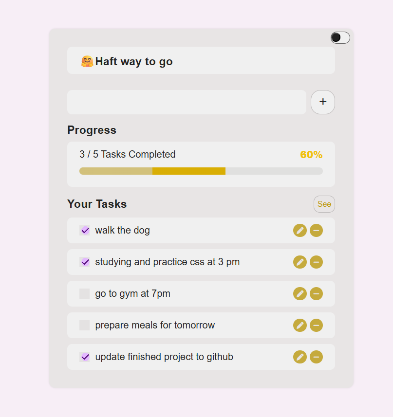

# To Do List App

This is a To Do Task App built with html, css and javascript.
It helps users to creat new, edit, delete tasks and persistant data storage using localStorage.

## Purpose
This project is apart from learning html, css and javascript in online tutorials and websites.
To practice web development skills including:

* HTML structure and form elements

* CSS styling and layout

* JavaScript logic, DOM manipulation, and event handling

* Saving and retrieving data using localStorage

* CRUD

* Responsive design

* Toggle light/dark mode

## Features
😊 Cover page of web app

✅ Add new tasks

✏️ Edit tasks

❌ Delete tasks

👁️ show/hide tasks'list

📦 Storage using localStorage

📊 Progress tracker/status with dynamic percentage and motivational messages 

🎯 Responsive and clean design

🌗 Toggle between Dark and Light themes

## How to use

* Enter a task and click add button or press Enter to add it

* Use the checkbox to mark tasks as complete

* Click the edit icon to revise a task name

* Click the delete icon to remove a task

## Tech Stack

* HTML5
* CSS3
* Vanilla JavaScript
* Font Awesome

## Screenshots

## License

MIT License
